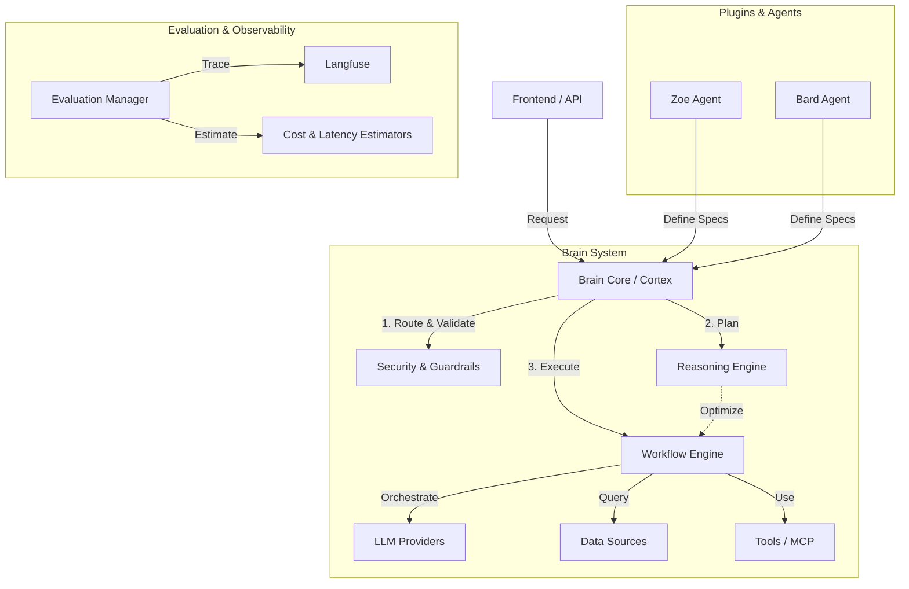

# ThinkLife Brain Architecture

## Overview

The ThinkLife Brain is a **generalized AI orchestration system** designed to manage multiple AI agents, ensuring consistent safety, context management, and execution patterns. It uses a plugin-based architecture where agents define *what* they need, and the Brain handles *how* it is executed.

## High-Level Architecture



## Core Components

### 1. Cortex (The Brain Core)
*   **Role:** The central nervous system.
*   **Responsibilities:**
    *   Receives requests from the API/Frontend.
    *   Delegates to specific Agent Plugins (e.g., Zoe) to get execution specifications.
    *   Orchestrates the two-phase execution process: **Planning** and **Execution**.
    *   Manages the lifecycle of the request.

### 2. Agent Plugins
*   **Role:** Domain-specific logic adapters.
*   **Responsibilities:**
    *   Implement the `IAgent` interface.
    *   Translate user requests into `AgentExecutionSpec` (defining prompt, tools, data sources).
    *   Handle post-processing of results (e.g., formatting, additional safety checks).
    *   **Example:** `ZoeAgent` defines the trauma-informed personality and prompts.

### 3. Reasoning Engine
*   **Role:** The planner and optimizer.
*   **Responsibilities:**
    *   Analyzes the `AgentExecutionSpec`.
    *   Can "reason" about the request to optimize the plan (e.g., "Do we need a search tool for this?").
    *   Supports different strategies: `direct` (fast), `reasoned` (thoughtful), `adaptive` (mixed).

### 4. Workflow Engine
*   **Role:** The execution arm.
*   **Responsibilities:**
    *   Takes the final `ExecutionPlan`.
    *   Executes the plan using a state machine (LangGraph-based).
    *   Handles the loop of: Initialize -> Context -> Tools -> LLM -> Validation -> Response.
    *   Validates responses with confidence scoring (0.0-1.0 scale).
    *   Implements retry mechanism for low confidence responses (threshold: 0.75).
    *   Manages provider interactions (OpenAI, etc.).

### 5. Validation & Confidence Scoring
*   **Role:** Quality assurance and response validation.
*   **Responsibilities:**
    *   **Confidence Scoring:** Calculates confidence score (0.0-1.0) for every response.
    *   **Validation Loop:** Automatically retries responses below threshold (0.75).
    *   **Reasoning Validation:** Validates reasoning engine output before workflow execution.
    *   **Feedback Integration:** Incorporates validation feedback into retry attempts.
    *   **Threshold Decision:** Accepts high confidence, retries moderate, uses fallback after max attempts.

### 6. Evaluation & Observability
*   **Role:** The monitor.
*   **Responsibilities:**
    *   **Langfuse Integration:** Traces every step of the execution for debugging and analytics.
    *   **Estimators:** Predicts cost and latency before execution.
    *   **Evaluators:** Assesses response quality (empathy, safety) after execution (optional).

## The Execution Flow

1.  **Request:** User sends a message to `/api/chat`.
2.  **Plugin Phase:** `ZoeService` calls `ZoeAgent` to create an `AgentExecutionSpec`.
    *   Specs include: "Use OpenAI GPT-4o", "Query Vector DB", "Max tokens 1500".
3.  **Cortex Planning:** `Cortex` receives specs.
    *   Checks guardrails (Auth, Rate Limit).
    *   Estimates cost/latency.
    *   (Optional) `ReasoningEngine` optimizes the plan.
    *   Validates reasoning output (if reasoning was used).
4.  **Execution:** `WorkflowEngine` runs the plan.
    *   Queries Vector DB (if needed).
    *   Calls OpenAI.
    *   Validates response quality with confidence scoring.
    *   Retries if confidence < 0.75 (max 5 attempts).
    *   Replaces with fallback if still low confidence after max attempts.
5.  **Response:** Result returns with confidence score to `ZoeAgent`.
6.  **Agent Decision:** `ZoeAgent` checks confidence.
    *   If confidence >= 0.75: Returns response to `ZoeService`.
    *   If confidence < 0.75: Uses context-aware fallback response.
7.  **Frontend:** Final response delivered to user.

## Directory Structure

```
backend/
├── agents/                 # Domain logic (Zoe, etc.)
├── brain/                  # Core system
│   ├── cortex/             # Orchestration (Cortex, Reasoning, Workflow)
│   ├── data_sources/       # Vector DB, etc.
│   ├── guardrails/         # Security, Session management
│   ├── providers/          # LLM adapters (OpenAI, Anthropic)
│   ├── specs/              # Data classes & Interfaces
│   └── tools/              # Tool definitions
├── evaluation/             # Estimators & Evaluators
│   ├── estimators/         # Cost & Latency logic
│   └── evaluators/         # Quality checks
├── middleware/             # Auth middleware
└── plugins/                # Agent connectors
```
