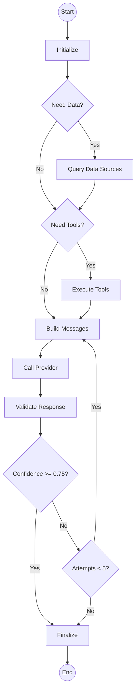

# Workflow Engine Architecture

## Overview

The **Workflow Engine** (`backend/brain/cortex/workflow_engine.py`) is the execution arm of the Brain. It uses a **LangGraph-based state machine** to orchestrate the lifecycle of an LLM request.

## Architecture

The engine operates on a validation-enhanced loop:
`Initialize` -> `Data Sources` -> `Tools` -> `Build Messages` -> `Call Provider` -> `Validate Response` -> `Finalize`

If validation fails (confidence < 0.75), the engine loops back to `Build Messages` with feedback (max 5 attempts).

### State Machine (LangGraph)



### Key Components

1.  **WorkflowState (`TypedDict`):**
    *   Stores the entire context of the execution (request, specs, results, errors, history).
    *   Tracks validation state: `confidence_score`, `validation_attempts`, `max_validation_runs`, `is_validated`, `validation_feedback`.
    *   Passed between all nodes in the graph.

2.  **WorkflowEngine Class:**
    *   **`execute_plan`:** Entry point. Takes an `ExecutionPlan` and runs the graph.
    *   **Nodes:**
        *   `_query_data_sources_node`: Fetches data from Vector DB, etc.
        *   `_execute_tools_node`: Runs MCP tools.
        *   `_build_messages_node`: Constructs the final prompt (System + Context + User + Retry Feedback if applicable).
        *   `_call_provider_node`: Invokes the LLM (OpenAI, etc.).
        *   `_validate_response_node`: Calculates confidence score and validates response quality.
        *   `_finalize_node`: Replaces low confidence responses with fallback if needed.

3.  **Provider Registry:**
    *   The engine dynamically loads the correct provider (e.g., `OpenAIProvider`) based on `specs.provider`.

## Integration

### Input: `ExecutionPlan`
The engine receives a fully formed plan from Cortex. It does **not** decide *what* to do, only *how* to execute it.

```python
class ExecutionPlan:
    optimized_specs: AgentExecutionSpec  # What to run
    reasoning_notes: Dict                # Why we are running it
    # ...
```

### Output: `Dict`
Returns a standardized result dictionary:

```python
{
    "success": True,
    "content": "Hello world...",
    "confidence": 0.85,  # Confidence score (0.0-1.0)
    "execution_id": "uuid...",
    "status": "completed",
    "metadata": {
        "execution_steps": ["initialize", "build_messages", "call_provider", "validate_response", "finalize"],
        "confidence_score": 0.85,
        "validation_attempts": 1,
        "errors": [],
        "duration_seconds": 1.2
    },
    "execution_plan": {...} # The plan that was executed
}
```

## Validation & Confidence Scoring

### Overview
The workflow engine includes an automatic validation loop that evaluates every LLM response before finalization.

### Confidence Calculation
Each response receives a confidence score (0.0-1.0) calculated through:

1. **Rule-Based Checks (30% weight)**
   - Length validation (minimum 10 characters)
   - Word count check (minimum 3 words)
   - Error pattern detection (refusals, apologies)
   - Pass all checks: base score 0.5

2. **LLM Validation (70% weight)**
   - Relevance: 0-25 points
   - Helpfulness: 0-25 points
   - Accuracy: 0-25 points
   - Completeness: 0-25 points
   - Total: 0-100 points normalized to 0.0-1.0

3. **Final Score**
   ```python
   final_confidence = (rule_based_score × 0.3) + (llm_score × 0.7)
   ```

### Decision Logic

```python
if confidence >= 0.75:
    # Accept and finalize
    return response
elif validation_attempts < 5:
    # Retry with feedback
    loop_back_to_build_messages()
else:
    # Max attempts reached, use fallback
    replace_with_fallback_response()
```

### Retry Mechanism
When confidence is below threshold:
- Validation feedback is captured from LLM evaluation
- Feedback is injected into system prompt for next attempt
- Response is regenerated with improvement guidance
- Process repeats up to 5 times total

### Low Confidence Handling
After max attempts with confidence < 0.75:
- Brain replaces response with generic fallback message
- Agent (e.g., Zoe) receives low confidence score
- Agent can use context-aware fallback instead of brain's generic message

## Observability

Every step is decorated with `@observe` (Langfuse) to track:
*   Inputs/Outputs of each node.
*   Confidence scores and validation attempts.
*   Latency of data fetching vs LLM generation vs validation.
*   Full error stacks if failure occurs.

## Extending

To add a new step (e.g., "Safety Check Node"):
1.  Define `_safety_check_node` method.
2.  Add it to the graph in `_build_graph`: `workflow.add_node("safety_check", self._safety_check_node)`.
3.  Update edges to route through it.
